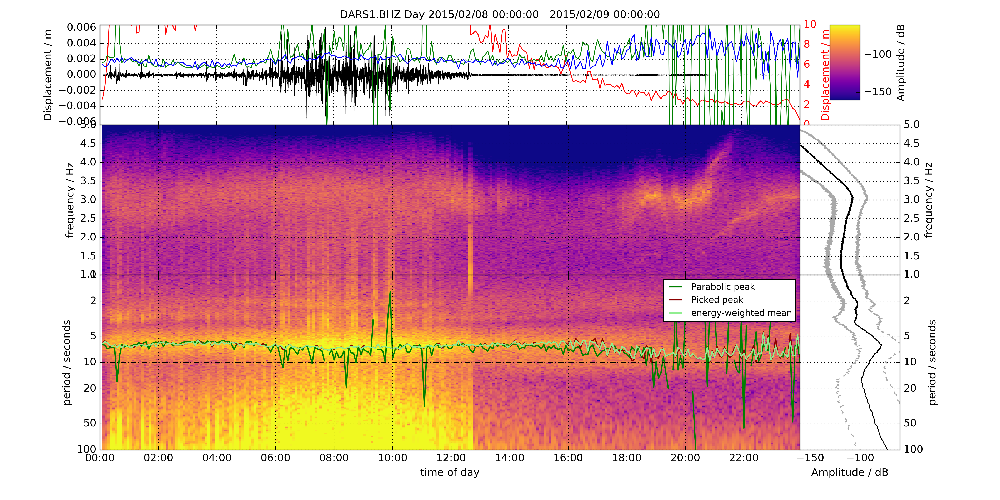

# seismic-spectrogram

A Python package for computing and visualising **seismic spectrograms** from
MiniSEED waveform data, with support for instrument response removal, gap-aware
multi-trace rendering, and optional harmonic / peak picking.



---

## Features

- **Gap-aware rendering** — data gaps appear as blank space (no zero-padding artefacts)
- **Dual-panel spectrogram** — high-frequency (Hz axis) and low-frequency (period axis) panels
- **Instrument response removal** via ObsPy + StationXML (graceful fallback to raw counts)
- **Harmonic Product Spectrum** picker for detecting fundamental frequencies
- **Station alias map** — automatically renames hardware serial numbers to canonical SEED codes
- **Clean modular design** — each concern lives in its own module with full docstrings and type hints

---

## Quick Start

### 1. Install dependencies

```bash
pip install obspy numpy matplotlib scipy
# optional, for progress bars:
pip install tqdm
```

Or with conda (recommended):

```bash
conda install -c conda-forge obspy numpy matplotlib scipy
```

### 2. Run on a single file

```bash
python src/run_spectrogram.py doc/testdata.mseed
```

Output PNG will be saved to `./Spectrograms/`.

### 3. Common options

```bash
# Custom colour scale (e.g. for hydrophone data)
python src/run_spectrogram.py data.mseed --vmin -60 --vmax 40

# Longer windows → finer frequency resolution
python src/run_spectrogram.py data.mseed --winlen 600

# Apply a display band-pass filter to the waveform panel
python src/run_spectrogram.py data.mseed --fmin_plot 1.0 --fmax_plot 10.0

# Pick harmonic peaks
python src/run_spectrogram.py data.mseed --kind harmonic --fmin 0.4 --fmax 1.2

# Full usage
python src/run_spectrogram.py --help
```

### 4. Batch processing

```bash
python src/run_batch.py \
    --data-dir /path/to/archive \
    --station DARS1 \
    --pattern "*.seed" \
    --out-path output/
```

---

## Python API

```python
from spectrogram import calc_spec, SpectrogramConfig

# Customise any parameter
cfg = SpectrogramConfig(
    vmin=-160,
    vmax=-60,
    winlen=600,        # 10-minute spectrogram windows
    plot_highfreq=True,
    dpi=150,
    path_out="output/",
)

f, t, s = calc_spec("waveform.mseed", cfg=cfg)
```

---

## Project Structure

```
seismic-spectrogram/
├── src/
│   ├── spectrogram/           # installable package
│   │   ├── __init__.py        # public API: calc_spec, SpectrogramConfig
│   │   ├── config.py          # station aliases, overrides, inventory paths
│   │   ├── preprocessing.py   # alias resolution, inventory loading, response removal
│   │   ├── analysis.py        # HPS, spectrogram peak picking, displacement integration
│   │   ├── plotting.py        # all matplotlib figure construction and rendering
│   │   ├── core.py            # calc_spec() — main orchestrator
│   │   └── io.py              # filename helpers, pick file writer
│   ├── run_spectrogram.py     # CLI: single-file or glob pattern
│   └── run_batch.py           # CLI: batch over a data directory tree
├── tests/
│   └── test_core.py           # pytest smoke tests
├── legacy/                    # old unrefactored scripts
├── doc/
│   └── testdata.mseed         # bundled test data (BB network, 1 day)
├── requirements.txt
└── README.md
```

---

## Configuration

### Station aliases

Some data archives store hardware serial numbers as station codes.
Edit `spectrogram/config.py` → `STATION_ALIASES` to map them to canonical names:

```python
STATION_ALIASES = {
    "12166": {"station": "MB01", "network": "1R", "location": "00"},
    # add more as needed ...
}
```

### Instrument response

Set the paths to your local StationXML files in `spectrogram/config.py` → `INVENTORY_PATHS`:

```python
INVENTORY_PATHS = {
    "BB_template": "/path/to/{net}.info/{net}.FDSN.xml/{net}.{sta}.xml",
    "MYSTA": "/path/to/MYSTA.xml",
}
```

If no inventory is found the script continues with raw counts and logs a warning.

---

## Running Tests

```bash
pip install pytest
python -m pytest tests/ -v
```

---

## Dependencies

| Package | Version | Purpose |
|---------|---------|---------|
| [ObsPy](https://docs.obspy.org/) | ≥ 1.4 | MiniSEED I/O, instrument response |
| NumPy  | ≥ 1.24 | Array processing |
| Matplotlib | ≥ 3.5 | Plotting |
| SciPy  | ≥ 1.10 | Signal processing (decimation, convolution, optimisation) |
| tqdm   | ≥ 4.0  | Progress bars (optional) |

---

## License

This project is distributed under the [GNU Lesser General Public License v3](https://www.gnu.org/licenses/lgpl-3.0.html).
